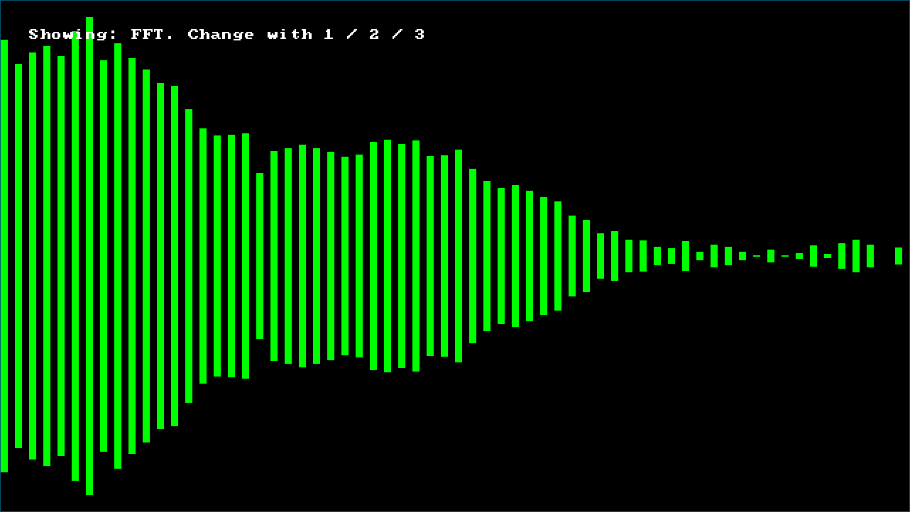

# fft.c

Implementation of DFT and FFT in C99, with a bonus cool music
visualization.

- Author:  Giovanni Santini
- Mail:    giovanni.santini@proton.me
- License: MIT

## Demo

https://github.com/user-attachments/assets/41c55951-0b4e-4b70-b6bc-aba1428d7f2e
